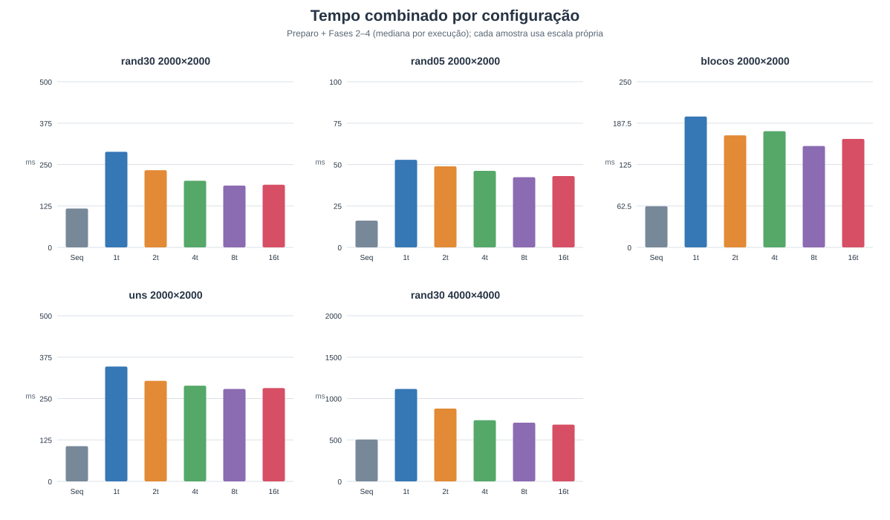
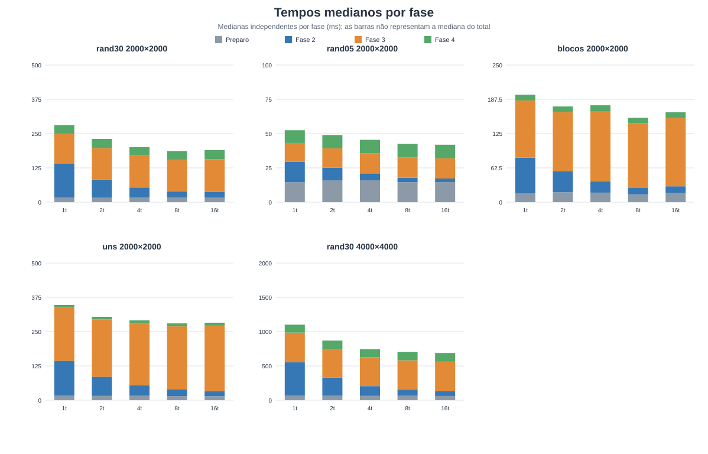

# Análise de desempenho

## Ambiente e método

- Matrizes: 1200×1200.
- Sistema: Windows, Intel Core i7-1255U (10 núcleos, 12 processadores lógicos).
- Compilador: GCC, flags `-std=c89 -Wall -Wextra -pedantic -O2`, link com `-pthread`.
- Paralelismo: BR×BC = 16×16, total de 256 blocos, com 4 e 8 threads.
  A configuração de 2 threads não foi medida.
- Repetições: 10 execuções por entrada e configuração; valores apresentados são medianas.
- Entradas:
  - **Fragmentada (51.284 objetos):** matriz pseudoaleatória, semente 123. Em blocos de 80×80 alternados em padrão de xadrez, cada célula tinha probabilidade 55% ou 15% de ser 1.
  - **Um componente grande (1 objeto):** matriz totalmente preenchida com 1 (densidade 100%).

Os arquivos de entrada foram gerados no diretório temporário para os testes e
não fazem parte do repositório.

## Resultados

Todos os tempos estão em milissegundos. “Paralelo (Fases 2–4)” inclui as
Fases 2, 3 e 4. “Paralelo combinado” é a mediana, calculada por execução,
de preparo + Fases 2–4; evita somar medianas de fases obtidas
separadamente.

| Entrada | Configuração | Objetos | Sequencial (contagem) | Preparo paralelo | Fase 2 | Fase 3 | Fase 4 | Paralelo (Fases 2–4) | Paralelo combinado |
|---|---:|---:|---:|---:|---:|---:|---:|---:|---:|
| Fragmentada | Sequencial | 51.284 | 64,267 | — | — | — | — | — | — |
| Fragmentada | Paralelo, 4 threads | 51.284 | — | 7,991 | 27,150 | 65,522 | 14,790 | 107,378 | 113,665 |
| Fragmentada | Paralelo, 8 threads | 51.284 | — | 7,160 | 17,127 | 53,743 | 13,530 | 85,350 | 91,780 |
| Um componente grande | Sequencial | 1 | 39,541 | — | — | — | — | — | — |
| Um componente grande | Paralelo, 4 threads | 1 | — | 6,102 | 22,137 | 87,556 | 4,410 | 115,135 | 121,367 |
| Um componente grande | Paralelo, 8 threads | 1 | — | 6,287 | 15,676 | 82,896 | 3,872 | 103,794 | 110,327 |

## O que cada tempo mede

- **Sequencial (contagem):** cronometra `flood_contar_seq`, incluindo a
  alocação e liberação de suas estruturas de trabalho. Não inclui leitura do
  arquivo nem liberação da matriz de entrada.
- **Preparo paralelo:** alocação de `labels`, divisão e configuração dos
  blocos, criação/inicialização da DSU, inicialização do mutex e alocação do
  vetor de threads. É mostrado à parte e somado ao tempo paralelo combinado.
- **Fase 2:** criação e junção das threads, retirada dos blocos da fila e
  rotulagem local via BFS.
- **Fase 3:** consolidação sequencial das fronteiras usando Union-Find.
- **Fase 4:** contagem dos representantes únicos.
- **Paralelo (Fases 2–4):** soma cronometrada de Fases 2, 3 e 4; não inclui
  preparo nem leitura.
- **Paralelo combinado:** preparo + Fases 2–4. Continua sem incluir leitura,
  destruição da DSU, liberação de estruturas e demais operações de limpeza.
- A leitura foi cronometrada separadamente pelo programa, mas não está na
  tabela para não misturar I/O e parsing com a comparação da contagem.

## Análise

O tempo combinado paralelo excedeu o tempo sequencial em todas as
configurações. Na matriz fragmentada, as medianas combinadas foram 1,77×
(4 threads) e 1,43× (8 threads) o tempo sequencial. Na matriz de um
componente, foram 3,07× e 2,79×, respectivamente.

A Fase 2 ficou mais rápida com 8 threads que com 4, nas duas entradas.
Entretanto, a Fase 3 foi o maior custo paralelo: 53,743–65,522 ms na matriz
fragmentada e 82,896–87,556 ms na matriz de um componente. Como essa fase é
sequencial e percorre os vizinhos rotulados para consolidar componentes, o
paralelismo da BFS não compensou seu custo neste algoritmo e nessas entradas.

Os resultados não confirmam a expectativa de que um componente grande, por
si só, faria esta implementação paralela superar a sequencial. Eles mostram
que o custo da consolidação e o trabalho redundante nas fronteiras precisam
ser considerados antes de concluir sobre o ganho de paralelismo. Os números
caracterizam apenas estas matrizes, parâmetros e ambiente; não são uma
estimativa universal de desempenho.

As contagens foram iguais entre as versões sequencial e paralela em ambas as
matrizes. Os 8 arquivos de teste pequenos do repositório também produziram
contagens iguais nas duas versões.

---

# Segunda medição — ambiente Linux (06/10/2026)

Esta seção é uma repetição independente do experimento em outra máquina e
outro sistema operacional, com matrizes maiores e uma bateria de entradas
mais variada. Ela **confirma** a conclusão da medição anterior e acrescenta
a quantificação de *por que* a versão paralela fica atrás.

## Ambiente e método

- Sistema: Linux 6.17 (Ubuntu), Intel Core i7-13620H — 10 núcleos físicos,
  16 threads de hardware.
- Compilador: `cc` (GCC 15.2.0), flags `-std=c89 -Wall -Wextra -pedantic -O2`,
  link com `-pthread`. Compila **sem nenhum aviso**; também sem avisos com
  `-Wdeclaration-after-statement -Wvla -Wshadow -Wstrict-prototypes
  -Wold-style-definition -Wmissing-prototypes`.
- Repetições: 10 por configuração nas matrizes 2000×2000 e 5 na 4000×4000.
  Todos os valores apresentados são **medianas**.
- Configurações: sequencial e paralela com 1, 2, 4, 8 e 16 threads, nas
  grades 1×1, 2×1, 2×2, 4×2 e 4×4 respectivamente.
- Entradas (5 matrizes geradas no formato `.txt`, com semente fixa 42 do
  gerador Mersenne Twister do Python, para que sejam reproduzíveis):
  as `rand*` são ruído branco com a densidade indicada; a `blocos` sorteia
  uma grade 100×100 com 45% de 1s e amplia cada sorteio num quadrado de
  20×20 células, produzindo poucos objetos muito grandes.

| Matriz | Dimensões | Densidade de 1s | Objetos | Caracteriza |
|---|---:|---:|---:|---|
| `rand05_2000x2000` | 2000×2000 | 5% | 162.008 | esparsa, muitos objetos minúsculos |
| `rand30_2000x2000` | 2000×2000 | 30% | 188.187 | densa e fragmentada |
| `blocos_2000x2000` | 2000×2000 | 45% | 97 | poucos objetos muito grandes |
| `uns_2000x2000` | 2000×2000 | 100% | 1 | um único objeto cobrindo tudo |
| `rand30_4000x4000` | 4000×4000 | 30% | 756.558 | mesma forma, 4× mais células |

A configuração **1 thread em grade 1×1** é a referência de overhead: sem
fronteiras entre blocos e sem paralelismo, ela isola quanto custam as fases
seriais que a versão sequencial simplesmente não tem.

## Correção

Antes de medir desempenho, a equivalência entre as versões foi verificada
de forma sistemática:

- **21 matrizes** (as 5 obrigatórias, as 3 tabelas 10×10 do editor do
  professor, as 3 de `Testes/10x10/` e 10 casos de borda gerados) × **10
  configurações** de threads/grade = 210 execuções paralelas.
- As 210 produziram **exatamente a mesma contagem** que a sequencial.
- Casos de borda cobertos: matriz 1×1 (com 0 e com 1), linha única, coluna
  única, toda 0, toda 1, moldura tocando as 4 bordas, xadrez diagonal
  (1 objeto só, por conectividade-8), pontos isolados (100 objetos) e
  listras verticais.
- Grades testadas incluem 1×1 (sem fronteiras), grades retangulares, mais
  threads que blocos (16 threads / 4 blocos) e grade maior que a matriz
  (50×50 numa matriz 5×5, exercitando o *clamp* de BR/BC).

Ferramentas de análise dinâmica, nas duas versões:

| Ferramenta | Resultado |
|---|---|
| `valgrind --leak-check=full` | `0 errors`; "All heap blocks were freed — no leaks are possible" |
| `valgrind --tool=helgrind` | `0 errors` (nenhuma condição de corrida) |
| `valgrind --tool=drd` | `0 errors` (nenhuma condição de corrida) |

Os caminhos de erro também foram exercitados (sem argumentos, arquivo
inexistente, `n_threads` igual a 0 ou não numérico, BR/BC igual a 0, valor
inválido no `.txt`, `.c` sem `#define LINHAS`, `.c` truncado): todos
terminam com mensagem em `stderr` e código de saída 1.

## Resultados

Tempos em milissegundos (medianas). "Paralelo (2–4)" = Fases 2+3+4;
"Combinado" = preparo + Fases 2–4. `S = T_seq / T_combinado` e
`E = S / n_threads`.

### rand30_2000x2000 — 188.187 objetos — sequencial: 117,370 ms

| Config | Preparo | Fase 2 | Fase 3 | Fase 4 | Paralelo (2–4) | Combinado | S | E |
|---|---:|---:|---:|---:|---:|---:|---:|---:|
| 1t 1×1 | 16,723 | 124,917 | 107,158 | 32,317 | 270,039 | 286,762 | 0,41 | 0,41 |
| 2t 2×1 | 16,328 | 66,739 | 114,258 | 33,243 | 217,274 | 233,602 | 0,50 | 0,25 |
| 4t 2×2 | 16,427 | 36,995 | 115,648 | 31,506 | 185,132 | 201,559 | 0,58 | 0,15 |
| 8t 4×2 | 16,367 | 22,207 | 115,719 | 32,041 | 171,505 | 187,871 | 0,62 | 0,08 |
| 16t 4×4 | 17,369 | 20,153 | 119,200 | 33,107 | 172,332 | 189,701 | 0,62 | 0,04 |

### rand05_2000x2000 — 162.008 objetos — sequencial: 16,137 ms

| Config | Preparo | Fase 2 | Fase 3 | Fase 4 | Paralelo (2–4) | Combinado | S | E |
|---|---:|---:|---:|---:|---:|---:|---:|---:|
| 1t 1×1 | 14,492 | 14,920 | 13,706 | 9,327 | 37,584 | 52,076 | 0,31 | 0,31 |
| 2t 2×1 | 15,900 | 9,293 | 14,088 | 9,688 | 33,657 | 49,557 | 0,33 | 0,16 |
| 4t 2×2 | 15,971 | 5,035 | 14,495 | 9,957 | 30,169 | 46,141 | 0,35 | 0,09 |
| 8t 4×2 | 14,587 | 3,147 | 14,759 | 10,052 | 27,937 | 42,524 | 0,38 | 0,05 |
| 16t 4×4 | 14,616 | 2,620 | 14,762 | 9,907 | 27,335 | 41,951 | 0,38 | 0,02 |

### blocos_2000x2000 — 97 objetos — sequencial: 62,130 ms

| Config | Preparo | Fase 2 | Fase 3 | Fase 4 | Paralelo (2–4) | Combinado | S | E |
|---|---:|---:|---:|---:|---:|---:|---:|---:|
| 1t 1×1 | 15,928 | 65,250 | 104,264 | 10,390 | 180,291 | 196,219 | 0,32 | 0,32 |
| 2t 2×1 | 17,854 | 38,173 | 108,181 | 10,288 | 154,377 | 172,231 | 0,36 | 0,18 |
| 4t 2×2 | 17,417 | 20,873 | 127,606 | 10,763 | 157,864 | 175,281 | 0,35 | 0,09 |
| 8t 4×2 | 14,272 | 12,370 | 117,142 | 10,080 | 138,572 | 152,844 | 0,41 | 0,05 |
| 16t 4×4 | 16,729 | 12,140 | 124,502 | 10,563 | 146,626 | 163,356 | 0,38 | 0,02 |

### uns_2000x2000 — 1 objeto — sequencial: 106,315 ms

| Config | Preparo | Fase 2 | Fase 3 | Fase 4 | Paralelo (2–4) | Combinado | S | E |
|---|---:|---:|---:|---:|---:|---:|---:|---:|
| 1t 1×1 | 16,291 | 127,259 | 194,403 | 8,976 | 332,486 | 348,777 | 0,30 | 0,30 |
| 2t 2×1 | 15,314 | 69,931 | 208,846 | 9,736 | 288,264 | 303,579 | 0,35 | 0,18 |
| 4t 2×2 | 17,401 | 36,978 | 226,845 | 9,942 | 272,388 | 289,789 | 0,37 | 0,09 |
| 8t 4×2 | 14,921 | 25,428 | 228,785 | 11,009 | 264,428 | 279,349 | 0,38 | 0,05 |
| 16t 4×4 | 14,310 | 18,285 | 239,096 | 10,822 | 267,017 | 281,327 | 0,38 | 0,02 |

### rand30_4000x4000 — 756.558 objetos — sequencial: 505,149 ms

| Config | Preparo | Fase 2 | Fase 3 | Fase 4 | Paralelo (2–4) | Combinado | S | E |
|---|---:|---:|---:|---:|---:|---:|---:|---:|
| 1t 1×1 | 65,773 | 489,506 | 429,968 | 117,179 | 1042,433 | 1108,206 | 0,46 | 0,46 |
| 2t 2×1 | 64,913 | 264,281 | 419,798 | 120,924 | 814,214 | 879,127 | 0,57 | 0,29 |
| 4t 2×2 | 63,306 | 142,102 | 418,147 | 121,053 | 673,802 | 737,108 | 0,69 | 0,17 |
| 8t 4×2 | 64,547 | 93,703 | 422,744 | 123,850 | 643,813 | 708,360 | 0,71 | 0,09 |
| 16t 4×4 | 61,296 | 67,900 | 432,309 | 126,809 | 620,110 | 681,406 | 0,74 | 0,05 |

## Análise

### O paralelismo funciona — a fase paralela escala bem

Isolando apenas a Fase 2 (BFS local nos blocos), a aceleração de 1 para 16
threads é consistente e próxima do que a máquina permite:

| Matriz | Fase 2 (1 thread) | Fase 2 (16 threads) | Aceleração da Fase 2 |
|---|---:|---:|---:|
| `rand05_2000x2000` | 14,920 | 2,620 | 5,69× |
| `rand30_2000x2000` | 124,917 | 20,153 | 6,20× |
| `blocos_2000x2000` | 65,250 | 12,140 | 5,37× |
| `uns_2000x2000` | 127,259 | 18,285 | 6,96× |
| `rand30_4000x4000` | 489,506 | 67,900 | 7,21× |

Em 16 threads de hardware (10 núcleos físicos com SMT), 5,4×–7,2× é o
esperado: os 6 núcleos *efficient* são mais lentos que os *performance*, e
threads SMT dividem unidades de execução. **A decomposição em blocos, a fila
de trabalho e a ausência de contenção na Fase 2 estão corretas e eficazes.**

### Mas as fases seriais custam mais do que todo o algoritmo sequencial

O problema é o que sobra. Na configuração de 1 thread/grade 1×1, onde não há
nenhum ganho de paralelismo para confundir a leitura:

| Matriz | Sequencial | Fase 2 (1t) | Preparo + Fases 3 e 4 |
|---|---:|---:|---:|
| `rand30_2000x2000` | 117,4 | 124,9 | **156,2** |
| `uns_2000x2000` | 106,3 | 127,3 | **219,7** |
| `rand30_4000x4000` | 505,1 | 489,5 | **612,9** |

A Fase 2 com 1 thread custa aproximadamente o mesmo que a contagem
sequencial inteira — o que faz sentido, pois é o mesmo BFS sobre as mesmas
células. O trabalho *adicional* (preparo + consolidação + contagem de
representantes) custa, por si só, **mais do que a versão sequencial
completa**. Ou seja: antes de a primeira thread extra entrar em cena, a
versão paralela já está com um débito de 1,2× a 2,3× o tempo da sequencial
(1,21× na 4000×4000, 2,33× na `rand05_2000x2000`), e esse débito não é
paralelizável.

### Fração serial medida e teto de Amdahl

Tomando `f_s` = (preparo + Fase 3 + Fase 4) / tempo total com 1 thread:

| Matriz | Fração serial `f_s` | Teto de Amdahl `1/f_s` | Melhor S medido (vs. sequencial) |
|---|---:|---:|---:|
| `rand30_2000x2000` | 0,56 | 1,80× | 0,62 (8t) |
| `rand05_2000x2000` | 0,72 | 1,40× | 0,38 (16t) |
| `blocos_2000x2000` | 0,67 | 1,50× | 0,41 (8t) |
| `uns_2000x2000` | 0,63 | 1,58× | 0,38 (8–16t) |
| `rand30_4000x4000` | 0,56 | 1,80× | 0,74 (16t) |

Com 56% a 72% do trabalho em código serial, a Lei de Amdahl limita a
aceleração a 1,4×–1,8× **em relação ao próprio tempo de 1 thread** — e esse
tempo de 1 thread já é 2,2×–3,3× o da versão sequencial. Daí o resultado
central: **nenhuma configuração superou a versão sequencial.** O melhor caso
foi `S = 0,74` (4000×4000, 16 threads), isto é, a paralela ainda levou 35%
mais tempo. Isso explica também por que a eficiência cai tão rápido
(`E = 0,04` com 16 threads): adicionar threads só encurta a fatia que já era
minoritária.

### Por que a Fase 3 é tão cara

A consolidação varre a matriz **inteira** e, para cada célula rotulada,
chama `dsu_unir` para os 8 vizinhos. Seu custo acompanha o número de células
rotuladas, não o número de objetos:

| Matriz | Células rotuladas | Fase 3 (1t) | Custo por célula |
|---|---:|---:|---:|
| `rand05_2000x2000` | 0,20 M | 13,7 ms | 68,5 ns |
| `rand30_2000x2000` | 1,20 M | 107,2 ms | 89,3 ns |
| `blocos_2000x2000` | 1,80 M | 104,3 ms | 57,9 ns |
| `uns_2000x2000` | 4,00 M | 194,4 ms | 48,6 ns |
| `rand30_4000x4000` | 4,80 M | 430,0 ms | 89,6 ns |

A matriz `blocos` (97 objetos) e a `rand30` (188 mil objetos) têm Fase 3
praticamente igual — ~105 ms — apesar de diferirem em três ordens de
grandeza no número de objetos. Confirma que o custo é dirigido pela
densidade, não pela quantidade de componentes.

A grande maioria dessas uniões é **redundante**: vizinhos dentro do mesmo
bloco já receberam o mesmo label na Fase 2, e `dsu_unir` sobre labels iguais
é uma operação inútil. Apenas as células nas fronteiras entre blocos
precisariam ser examinadas — uma fração de `O((BR+BC)·L)` contra os
`O(L·C)` atuais.

### A Fase 3 piora quando se aumenta o paralelismo

| Matriz | 1t | 2t | 4t | 8t | 16t |
|---|---:|---:|---:|---:|---:|
| `rand30_2000x2000` | 1,00× | 1,07× | 1,08× | 1,08× | 1,11× |
| `blocos_2000x2000` | 1,00× | 1,04× | 1,22× | 1,12× | 1,19× |
| `uns_2000x2000` | 1,00× | 1,07× | 1,17× | 1,18× | 1,23× |
| `rand30_4000x4000` | 1,00× | 0,98× | 0,97× | 0,98× | 1,01× |

Mais threads implicam mais blocos, logo mais fronteiras e mais uniões
*verdadeiras* a executar — o oposto do que se deseja de uma fase serial. O
efeito é mais forte justamente em `uns_2000x2000` (+23%), onde todo objeto
atravessa todas as fronteiras. É um caso de **contra-escalabilidade**: o
custo da parte serial cresce com o grau de paralelismo.

### Custo de memória

A versão paralela reserva labels por *tamanho de bloco* (pior caso), de modo
que `total_labels = L × C`. A DSU mantém dois vetores `int` desse tamanho:
numa matriz 4000×4000 são ~128 MB apenas de DSU, mais 64 MB da matriz
`labels` e 16 MB de `ja_visto` — contra ~80 MB de estruturas de trabalho da
versão sequencial. Isso também explica o tempo de "preparo" de 61–66 ms na
4000×4000: é essencialmente `calloc` e inicialização dessas estruturas.

## Conclusão desta medição

1. **Correção:** sólida. 21 matrizes × 10 configurações, sempre a mesma
   contagem da sequencial; sem vazamentos (`memcheck`) e sem condições de
   corrida (`helgrind` e `drd`).
2. **A parte paralela está bem construída:** a Fase 2 acelera 5,4×–7,2× com
   16 threads, sem contenção.
3. **O algoritmo como um todo não se beneficia:** a consolidação serial
   (Fase 3) e a contagem de representantes (Fase 4) representam 56%–72% do
   trabalho e, somadas ao preparo, custam mais que a versão sequencial
   inteira. Nenhuma configuração alcançou `S ≥ 1`; o melhor foi `S = 0,74`.
4. **Crescer a matriz melhora pouco:** com a mesma densidade de 30%, o melhor
   `S` subiu de 0,62 (2000×2000) para 0,74 (4000×4000). O ganho não vem de a
   parte serial encolher — ao quadruplicar as células, as fases seriais
   cresceram ~3,9× e a contagem sequencial cresceu 4,3×, de modo que o peso
   relativo do overhead apenas diminuiu um pouco (de 1,33× para 1,21× o tempo
   da sequencial). Como ambas as partes escalam com `L·C`, não há indício de
   que `S ≥ 1` seja alcançável apenas aumentando a matriz.

### Caminho identificado para que a paralela supere a sequencial

Diagnóstico direto dos dados, **não implementado** (manter o código como
está foi uma condição desta revisão):

- **Restringir a Fase 3 às fronteiras.** Hoje ela examina `L × C` células;
  bastam as linhas e colunas de borda dos blocos. Em grade 4×4 numa matriz
  2000×2000, isso reduz as células examinadas de 4 M para ~24 mil — três
  ordens de grandeza.
- **Fundir a Fase 4 na Fase 3** ou contar raízes percorrendo apenas os
  labels efetivamente atribuídos, em vez de todas as células.
- **Dimensionar os labels pelo número real de componentes** (duas passagens
  ou realocação) em vez de pelo número de células, cortando o preparo e a
  memória da DSU.

Com a Fase 3 reduzida a custo de fronteira, a fração serial cairia de ~0,6
para algo próximo de 0,1, e o teto de Amdahl subiria de ~1,6× para ~10×.

## Reprodução

```bash
make                                       # compila as duas versões
make test                                  # correção nas 8 matrizes do repositório
./conta-objetos-sequencial <matriz>        # referência de tempo
./conta-objetos-paralelo   <matriz> 8 4 2  # 8 threads, grade 4x2
```

A versão paralela imprime o tempo de cada fase separadamente (preparo,
Fases 2, 3 e 4), que é o que alimenta as tabelas acima. Para cada
configuração foram feitas 10 execuções (5 na 4000×4000) e tomada a mediana.

Os dados brutos desta medição (uma linha por execução, com os tempos de cada
fase) estão em [resultados.csv](resultados.csv). As matrizes grandes não são
versionadas (~56 MB); a descrição em "Ambiente e método" tem a densidade e a
semente necessárias para regerá-las.

## Amostras e gráficos

O CSV [amostras_resumo.csv](amostras_resumo.csv) consolida as execuções por
matriz e configuração, com medianas, número de repetições, aceleração e
eficiência. Para a versão paralela, `tempo_mediano_ms` é a mediana do tempo
combinado calculado em cada repetição (preparo + Fases 2–4), conforme a
definição da métrica combinada; `tempo_csv_mediano_ms` mantém separada a
mediana da coluna bruta `tempo_ms`. Os gráficos abaixo são gerados diretamente
dos registros versionados em `resultados.csv` pelo script
[gerar_graficos.py](gerar_graficos.py), usando apenas a biblioteca padrão do
Python:





Para regenerar os arquivos após atualizar os dados:

```bash
python results/gerar_graficos.py
```
